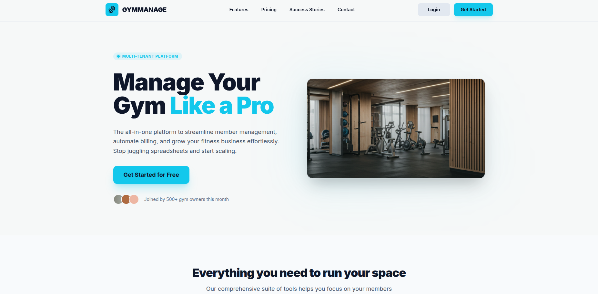
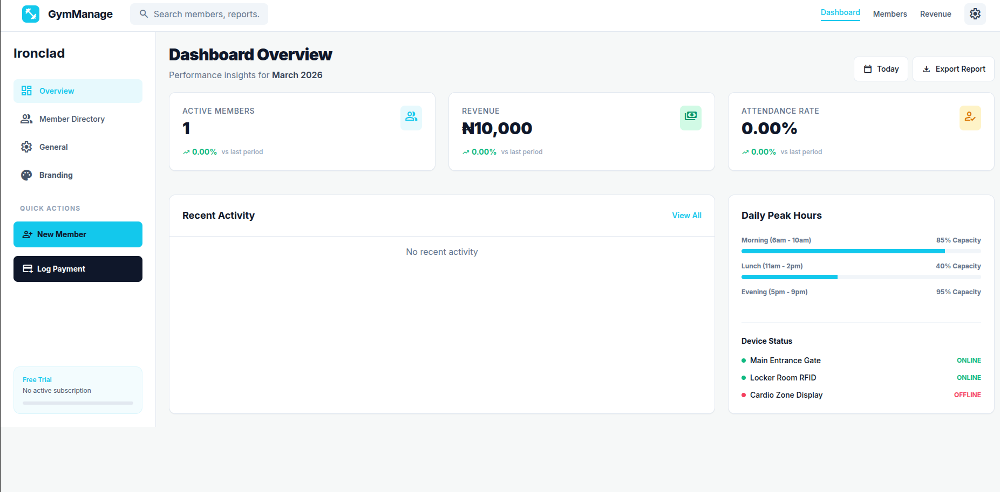
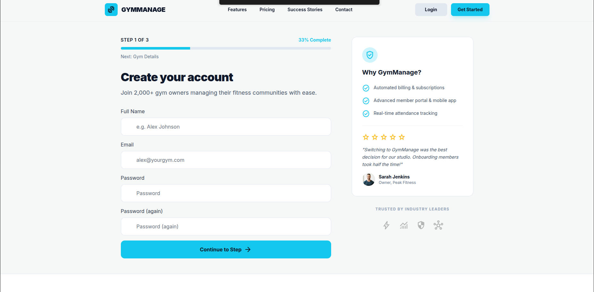

# GymManage

A saas web application to manage gym operations, memberships, subscriptions, and payments. Built with Django and Tailwind CSS for a clean, responsive UI.


## Screenshots






## Features
- Member management (active, expired, overdue tracking)
- Subscription and billing management with free trial support
- Gym owner signup and dashboard
- Multi-tenant branding support
- Real-time filtering and search

Tech Stack
- Backend: Django
- Frontend: Tailwind CSS, HTMX
- Database: PostgreSQL (or SQLite for local dev)
- Deployment: Docker, GitHub Container Registry

## Getting Started
Prerequisites
- Docker & Docker Compose
- Python 3.11+

# Local Development

- Clone the repository and rename to gymx:
```bash
git clone https://github.com/<your-username>/gym-management.git gymx
cd gymx
```

- Build and run the Docker container:

```
docker-compose -f docker-compose-local.yml up --build
```
- Create a localhost alias (gymx.local) for any domain you want to use

```
echo 127.0.0.1 gymx.local >> /etc/hosts
```
- Access the app:
```
http://gymx.local:8000
```

- Environment Variables

Create a .env file with the following variables:
```
DJANGO_SECRET_KEY=<your-secret-key>
DATABASE_URL=postgres://user:password@db:5432/gymdb
DEBUG=True
```
               